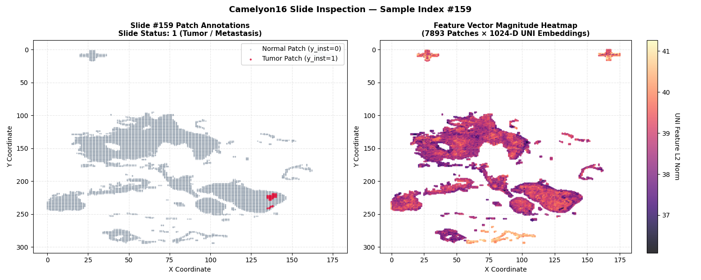
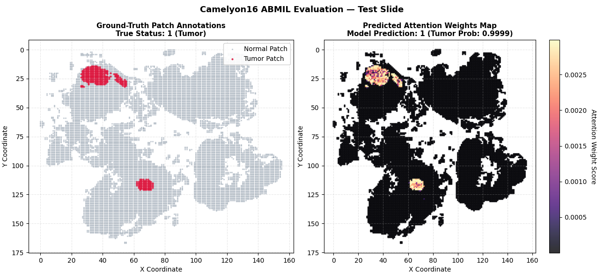

# Attention-based Deep Multiple Instance Learning for CAMELYON16 Dataset

This repository adapts **Attention-based Deep Multiple Instance Learning (ABMIL)** to the CAMELYON16 histopathology dataset. It treats each whole-slide image (WSI) as a *bag* of patch-level feature vectors and predicts whether that slide contains metastatic tissue.

The implementation provides two slide-level binary classifiers:

- **Attention MIL** — learns one normalized importance weight for every patch.
- **Gated Attention MIL** — uses an additional sigmoid gate when calculating patch importance.

The model is trained from **slide-level labels**. Patch labels and coordinates are only used by this repository during inference to visualize the predicted attention map; they are not fed into the training loss.

> This is an adaptation of the excellent open-source [AttentionDeepMIL](https://github.com/AMLab-Amsterdam/AttentionDeepMIL) implementation by **Maximilian Ilse, Jakub M. Tomczak, and Max Welling**. Their original repository implements the MNIST-bags experiment from the ABMIL paper. Thank you to the authors for making their code publicly available and enabling this CAMELYON16 reproduction.

## Dataset

This project uses the MIL-ready version of **CAMELYON16** distributed with [torchmil](https://torchmil.readthedocs.io/). The original benchmark contains H&E-stained lymph-node WSIs for metastasis detection. The torchmil version provides pre-extracted patches, patch embeddings, labels, and coordinates, so this project does **not** train directly from `.tif` slide images.

The loader uses `features="UNI"`; consequently every patch is expected to have a **1024-dimensional UNI feature vector**. A slide is represented as a tensor with shape:

```text
(number_of_patches, 1024)
```

The expected extracted dataset layout is:

```text
datasets/
└── dataset/                         # detected automatically by dataloader.py
    ├── splits.csv
    └── patches_512_preset/
        ├── features_UNI/            # one .npy feature matrix per slide
        ├── labels/                  # slide labels: 0 normal, 1 tumor
        ├── patch_labels/            # patch annotations, used for evaluation plots
        └── coords/                  # (x, y) coordinate per patch
```

`splits.csv` specifies the train/test split. Do not move individual files after downloading unless you also preserve this structure.

## Requirements

Use Python 3.9 or newer. Create and activate a virtual environment if desired, then install PyTorch using the command appropriate for your operating system and CUDA version from [pytorch.org](https://pytorch.org/get-started/locally/).

Install the remaining packages:

```bash
python -m pip install --upgrade pip
python -m pip install torchmil huggingface_hub numpy matplotlib tqdm
```

or

```bash
pip install -r requirements.txt
```

`torchmil` supplies the `CAMELYON16MILDataset` class. `huggingface_hub` downloads the processed dataset from the torchmil Hugging Face dataset repository.

## 1. Prepare the dataset

[`dataloader.py`](dataloader.py) contains the complete preparation workflow:

1. `download_camelyon16()` downloads `torchmil/Camelyon16_MIL` to `./datasets`.
2. `extract_dataset_archives()` extracts downloaded `.tar.gz` archives.
3. `repair_and_extract_camelyon16()` handles the Windows nested-folder layout that can result from extraction.
4. `visualize_dataset()` inspects slides, patch labels, coordinates, and UNI-feature magnitudes.

Run it from the repository root:

```bash
python dataloader.py
```

The first run can be large and take a significant amount of time and disk space. The script also opens Matplotlib figures. Close each figure window to continue.

### Repeat runs

The `if __name__ == "__main__":` block currently calls download, extraction, repair, visualization, and loader statistics every time. After the dataset is correctly prepared, comment out the first three calls in [`dataloader.py`](dataloader.py) before rerunning it if you only want to inspect data or print dataset statistics:

```python
# download_camelyon16(root_dir="./datasets")
# extract_dataset_archives("./datasets")
# repair_and_extract_camelyon16("./datasets")
visualize_dataset(root="./datasets", target_label=1)
```

You may change `target_label` to `0`, `1`, or `None`:

- `0`: inspect normal slides only.
- `1`: inspect tumor slides only.
- `None`: inspect all slides.

### Verify that preparation succeeded

At the end of `python dataloader.py`, the script builds train and test `DataLoader` objects and prints the positive-bag count and the mean, maximum, and minimum number of patches per slide. If it cannot find `splits.csv`, check that the extracted directory is below `./datasets` and that it contains a `patches_*` directory.

<p align="center">
  
</p>
<p align="center">Figure 1: Representative histopathology patch containing tumor cells from Camelyon16 dataset.</p>

For more information on the processed data and the `CAMELYON16MILDataset` API, see the [torchmil CAMELYON16 documentation](https://torchmil.readthedocs.io/en/main/examples/wsi_classification/).

## 2. Train ABMIL model

[`train.py`](train.py) is the entry point of main training script. It does the following in order:

1. Selects GPU when CUDA is available, otherwise CPU.
2. Creates `train_loader` and `test_loader` via `utils.load_dataset()`.
3. Instantiates the selected ABMIL model.
4. Trains for the requested number of epochs with Adam.

Run the standard attention model:

```bash
python train.py --root ./datasets --model_name attention --epoch_num 10
```

Run the gated-attention model:

```bash
python train.py --root ./datasets --model_name gated_attention --epoch_num 10
```

Useful arguments:

| Argument | Default | Meaning |
| --- | ---: | --- |
| `--root` | `./datasets` | Dataset parent directory. |
| `--epoch_num` | `10` | Number of training epochs. |
| `--lr` | `0.0005` | Adam learning rate. |
| `--weight_decay` | `0.0001` | Adam weight decay. |
| `--in_features` | `1024` | Input patch-feature size; use 1024 for UNI features. |
| `--patch_emb_size` | `500` | Latent embedding dimension (`M`). |
| `--attn_hid_size` | `128` | Attention hidden dimension (`L`). |
| `--model_name` | `attention` | Select `attention` or `gated_attention`. |
| `--seed` | `1` | PyTorch random seed. |

For example, a 20-epoch gated-attention experiment is:

```bash
python train.py --root ./datasets --model_name gated_attention --epoch_num 20 --lr 0.0005 --weights_path ./weights/model.pt
```

## What happens during training?

Each `DataLoader` batch has size one because slides contain different numbers of patches:

```text
data:  (1, N, 1024)  # DataLoader batch dimension, N varies by slide
label: [slide_label, instance_labels, coordinates]
```

The model removes the leading batch dimension, projects every 1024-D patch feature to an `M=500`-D embedding, calculates a normalized attention weight for each patch, and forms one slide embedding through a weighted sum. A sigmoid classifier produces `Y_prob`, the probability that the slide is tumor-positive. The loss is binary cross-entropy computed from the slide label only.

For ordinary attention, the score for patch embedding $h_i$ is:

$$
a_i = w^T\tanh(Vh_i)
$$

For gated attention, it is:

$$
a_i = w^T\left(\tanh(Vh_i) \odot \sigma(Uh_i)\right)
$$

After softmax normalization over all patches in a slide, the weights sum to one. Higher attention means the patch had greater influence on that slide's prediction; it should not be interpreted as a calibrated per-patch tumor probability.

## 3. Inference output and attention maps

[`inference.py`](inference.py) performs the following steps:

1. Initializes the selected ABMIL architecture and loads the saved checkpoint from `./weights/model.pt` by default.
2. Switches the model to evaluation mode and runs it on every slide in the test split.
3. Reports each slide’s ground-truth label, predicted label, binary-cross-entropy loss, and classification error.
4. Computes and prints the overall slide-level classification accuracy.
5. When `show_plot=True`, displays a ground-truth patch-annotation map alongside the model’s attention-weight map for each test slide.

Run inference on the standard attention model:

```bash
python inference.py --root ./datasets --model_name attention --weights_path ./weights/model.pt
```

Run inference the gated-attention model:

```bash
python inference.py --root ./datasets --model_name gated_attention --weights_path ./weights/model.pt
```

During inference, [`utils.py`](utils.py) prints lines similar to:

```text
Bag GT: 1 Bag Pre: 1 Loss: 0.2134 Test Error: 0.0000
```

- `Bag GT`: ground-truth slide label (`0` normal, `1` tumor).
- `Bag Pre`: predicted slide label after thresholding probability at 0.5.
- `Loss`: binary cross-entropy for that slide.
- `Test Error`: `0.0` for a correct prediction and `1.0` for an incorrect one.

When `show_plot=True` in `inference.py`, inference shows two panels:

1. Ground-truth patch annotations using `patch_labels` and `coords`.
2. Predicted attention map: the same patch coordinates coloured by their normalized attention weights.

<p align="center">
  
</p>
<p align="center">Figure 2: Representative histopathology patch containing tumor cells used as an inference sample. .</p>

For a non-interactive run, change this line in [`inference.py`](inference.py):

```python
utils.run_inference(model=model, test_loader=test_loader, is_cuda=is_cuda, show_plot=True)
```

to:

```python
utils.run_inference(model=model, test_loader=test_loader, is_cuda=is_cuda, show_plot=False)
```

## Notes
- The displayed patch labels are for evaluation and visualization. They are not used as instance-level supervision during training.
- Results depend on hardware, PyTorch/torchmil versions, random initialization, and hyperparameters. 
- This repository is a research reproduction, not a clinical diagnostic system.

## Repository layout

```text
train.py        Command-line entry point: train abmil model
inference.py    Run inference based on trained model
utils.py        Device setup, loaders, training loop, inference, visualization.
dataloader.py   Download/extract/inspect CAMELYON16 and define Camelyon16Bags.
model.py        Attention and gated-attention ABMIL models.
datasets/       Download destination and dataset root.
```

## Acknowledgements and citation

This work builds on:

- Ilse, M., Tomczak, J. M., & Welling, M. (2018). *Attention-based Deep Multiple Instance Learning*. [arXiv:1802.04712](https://arxiv.org/abs/1802.04712).
- The original [AMLab-Amsterdam/AttentionDeepMIL](https://github.com/AMLab-Amsterdam/AttentionDeepMIL) repository by Maximilian Ilse, Jakub M. Tomczak, and Max Welling.
- The [torchmil](https://torchmil.readthedocs.io/) project and its processed CAMELYON16 dataset. Please cite torchmil and the original CAMELYON16 data source when using the dataset in research.

If you use this adaptation, please also cite the original ABMIL paper above and acknowledge the original repository and torchmil dataset preparation.

## License and Copyright

The project is open source under BSD-3 license (see the `LICENSE` file).